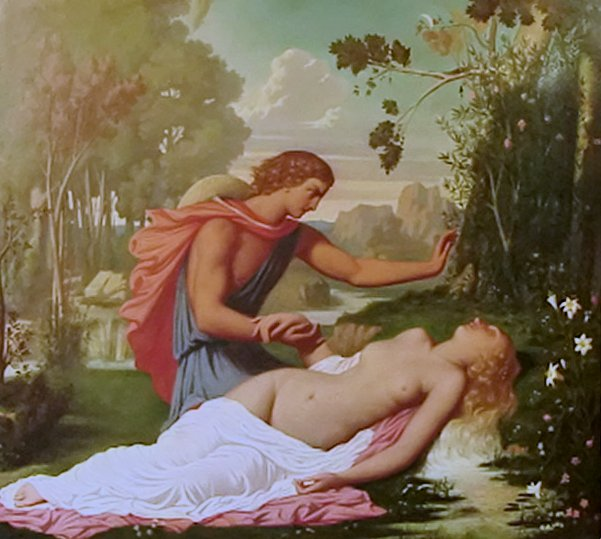
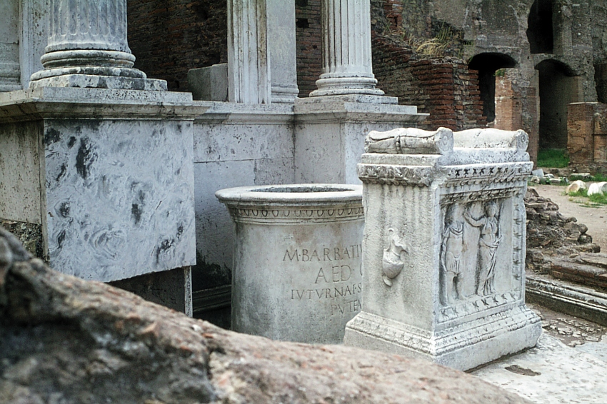

import Tabs from '@theme/Tabs';
import TabItem from '@theme/TabItem';

<Tabs>
  <TabItem value="Sommaire" label="📜Sommaire" default>
# 🚩Le plan

:::tip

Nous vous conceillons afn d'avoir la meilleur experience suivre le plan étapes par étapes!

:::


## 📷 Sommaire des pièces


  </TabItem>
  <TabItem value="orange" label="Basilique émilienne">
    
## ❓C'est quoi une basilique?
La fonction première de la basilica (siège du
Basileus ou roi) était l’exercice de la justice et
du commerce. C’était un lieu de rencontre et
de palabre. La basilique civile romaine servait
à la fois de tribunal, de bourse de commerce
et de lieu de promenade. Elle était avant tout
un local judiciaire. 


## 👀 Histoire de la basilique
En 179 av. J.-C., les censeurs Marcus Æmilius Lepidus et Marcus Fulvius Nobilior commandent et financent la construction de la basilique, originellement nommée basilique Fulvia ou basilique Æmilia.

En 159 av. J.-C., le censeur Publius Cornelius Scipio Nasica Corculum installe une clepsydre dans la basilique. La basilique ne garde que le nom de basilique Æmilia, perdant après le IIe siècle av. J.-C. celui de basilique Fulvia.

En 78 av. J.-C., le consul Marcus Æmilius Lepidus décore le bâtiment avec les boucliers ou les portraits gravés de ses ancêtres (imagines clipeatae) et fait quelques travaux de reconstruction.

En 54 av. J.-C., l'édile Lucius Aemilius Paullus, frère du triumvir Lépide, s'engage à restaurer la basilique grâce à l'argent du butin des Gaules réuni par César. Ce dernier fait aussi édifier en face la basilique Julia. Le bâtiment y gagne en splendeur et la reconstruction est achevée par son fils, à l'époque de son consulat, Lucius Æmilius Lepidus Paullus, qui consacre la basilique rénovée. Elle prend alors aussi le nom de basilique Paulli.

En 14 av. J.-C., la basilique brûle et est reconstruite au nom de la gens Æmilia. Elle est de nouveau restaurée en 22 ap. J.-C. par Marcus Aemilius Lepidus.

Au début du Ve siècle, les toits en bois de la nef et des ailes sont détruits dans un incendie, vraisemblablement lors du sac de Rome par Alaric Ier en 410. Les boutiques (tabernae) et la façade sont également détruites. Un tremblement de terre en 847 cause l'effondrement définitif des restes de la basilique.


## 📜 Vestiges

Seules les bases des colonnes extérieures et de la nef, ainsi que les bases des boutiques (tabernae) existent aujourd'hui, donnant le plan général de l'édifice.


  </TabItem>
  <TabItem value="banana" label="Rostres+ Comitium ">
 
  ## ❓C'est quoi les rostres?
 Les Rostres (rostra, pluriel du latin rostrum) sont, dans la Rome antique, des tribunes aux harangues qui, depuis 338 avant notre ère, servent aux magistrats et aux orateurs pour s'adresser aux assemblées et à la foule.

  ## ❓C'est quoi les comitium?
Dans la Rome antique, le Comitium est un espace prévu pour les réunions publiques en plein air. La plupart des cités romaines disposent d'un comitium pour les réunions publiques, les élections, les conciles et les procès. Il s'agit d'un espace consacré (templum) car selon la tradition, toutes les décisions et lois qui n'ont pas été prises dans un espace consacré choisi par les augures sont considérées comme invalides.

## 📜 Vestiges
Error: 404 not found!


  </TabItem>
  <TabItem value="tktdf" label="Aedes Saturini + castorum +vestae  + concordiae">
 


  </TabItem>

    <TabItem value="tkt" label="regia">
 


  </TabItem>

      <TabItem value="tktds" label="lacus juturnae">
  
  
  ## ❓C'est quoi?
La fontaine de Juturne est une fontaine de Rome construite sur une source ou un puits sur le Forum Romain. 
La fontaine est associée à un autel dédié à la nymphe Juturne. 


Le nom de Lacus Iuturnae se rapporte aussi bien à la source qu'à l'autel qui se dresse tout près.

## 📜 Vestiges




 


  </TabItem>

        <TabItem value="tktdsds" label="+Bientôt!">
        Vous l'avez remarqué? Il manque des salles et des information.
        Le site est toujours en cours de development et d'évolution , c'est un projet scolaire certes mais qui me tient a coeur. Si vous avez des connaissances sur ce milieu et sur le romanum vous pouvez modifier ce code: 
       
       
       
       
       
       
       
       
       
       
       
       
       
       
       
       
       
       
       
       
       
       
       
       
       
       
       
       
       
       
       
       
       
       
       
       
       
       
       
       
        ```jsx title="/doc/intro/intro.md"
---
id: "💻developpement"
title: "🚩Le plan"
sidebar_position: 1
---

import Tabs from '@theme/Tabs';
import TabItem from '@theme/TabItem';

<Tabs>
  <TabItem value="Sommaire" label="📜Sommaire" default>
# 🚩Le plan

:::tip

Nous vous conceillons afn d'avoir la meilleur experience suivre le plan étapes par étapes!

:::


## 📷 Sommaire des pièces


  </TabItem>
  <TabItem value="orange" label="Basilique émilienne">
    
## ❓C'est quoi une basilique?
La fonction première de la basilica (siège du
Basileus ou roi) était l’exercice de la justice et
du commerce. C’était un lieu de rencontre et
de palabre. La basilique civile romaine servait
à la fois de tribunal, de bourse de commerce
et de lieu de promenade. Elle était avant tout
un local judiciaire. 


## 👀 Histoire de la basilique
En 179 av. J.-C., les censeurs Marcus Æmilius Lepidus et Marcus Fulvius Nobilior commandent et financent la construction de la basilique, originellement nommée basilique Fulvia ou basilique Æmilia.

En 159 av. J.-C., le censeur Publius Cornelius Scipio Nasica Corculum installe une clepsydre dans la basilique. La basilique ne garde que le nom de basilique Æmilia, perdant après le IIe siècle av. J.-C. celui de basilique Fulvia.

En 78 av. J.-C., le consul Marcus Æmilius Lepidus décore le bâtiment avec les boucliers ou les portraits gravés de ses ancêtres (imagines clipeatae) et fait quelques travaux de reconstruction.

En 54 av. J.-C., l'édile Lucius Aemilius Paullus, frère du triumvir Lépide, s'engage à restaurer la basilique grâce à l'argent du butin des Gaules réuni par César. Ce dernier fait aussi édifier en face la basilique Julia. Le bâtiment y gagne en splendeur et la reconstruction est achevée par son fils, à l'époque de son consulat, Lucius Æmilius Lepidus Paullus, qui consacre la basilique rénovée. Elle prend alors aussi le nom de basilique Paulli.

En 14 av. J.-C., la basilique brûle et est reconstruite au nom de la gens Æmilia. Elle est de nouveau restaurée en 22 ap. J.-C. par Marcus Aemilius Lepidus.

Au début du Ve siècle, les toits en bois de la nef et des ailes sont détruits dans un incendie, vraisemblablement lors du sac de Rome par Alaric Ier en 410. Les boutiques (tabernae) et la façade sont également détruites. Un tremblement de terre en 847 cause l'effondrement définitif des restes de la basilique.


## 📜 Vestiges

Seules les bases des colonnes extérieures et de la nef, ainsi que les bases des boutiques (tabernae) existent aujourd'hui, donnant le plan général de l'édifice.


  </TabItem>
  <TabItem value="banana" label="Rostres+ Comitium ">
 
  ## ❓C'est quoi les rostres?
 Les Rostres (rostra, pluriel du latin rostrum) sont, dans la Rome antique, des tribunes aux harangues qui, depuis 338 avant notre ère, servent aux magistrats et aux orateurs pour s'adresser aux assemblées et à la foule.

  ## ❓C'est quoi les comitium?
Dans la Rome antique, le Comitium est un espace prévu pour les réunions publiques en plein air. La plupart des cités romaines disposent d'un comitium pour les réunions publiques, les élections, les conciles et les procès. Il s'agit d'un espace consacré (templum) car selon la tradition, toutes les décisions et lois qui n'ont pas été prises dans un espace consacré choisi par les augures sont considérées comme invalides.

## 📜 Vestiges
Error: 404 not found!


  </TabItem>
  <TabItem value="tktdf" label="Aedes Saturini + castorum +vestae  + concordiae">
 


  </TabItem>

    <TabItem value="tkt" label="regia">
  ## ❓C'est quoi la regia?
  La Regia est un édifice longeant la Via Sacra sur la partie est du Forum Romanum. Ce bâtiment servait à l'origine de résidence ou bien de siège aux rois de Rome et plus tard au pontifex maximus, le grand prêtre à la tête du collège des pontifes.


  </TabItem>

      <TabItem value="tktds" label="lacus juturnae">
 


  </TabItem>

        <TabItem value="tktdsds" label="+Bientôt!">
        Vous l'avez remarqué? Il manque des salles et des information.
        Le site est toujours en cours de development et d'évolution , c'est un projet scolaire certes mais qui me tient a coeur. Si vous avez des connaissances sur ce milieu et sur le romanum vous pouvez modifier ce code: 
       
       
        


        
 


  </TabItem>


</Tabs>


```

        
 


  </TabItem>


</Tabs>


